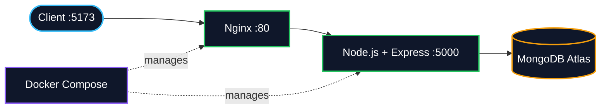
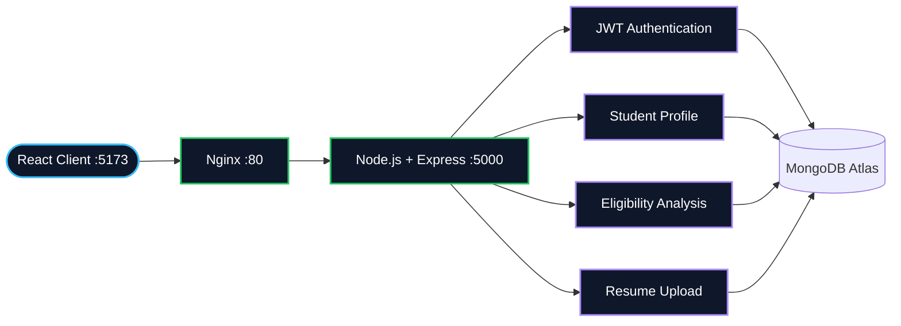
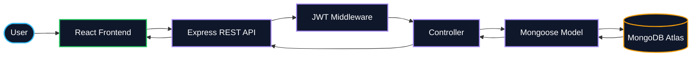
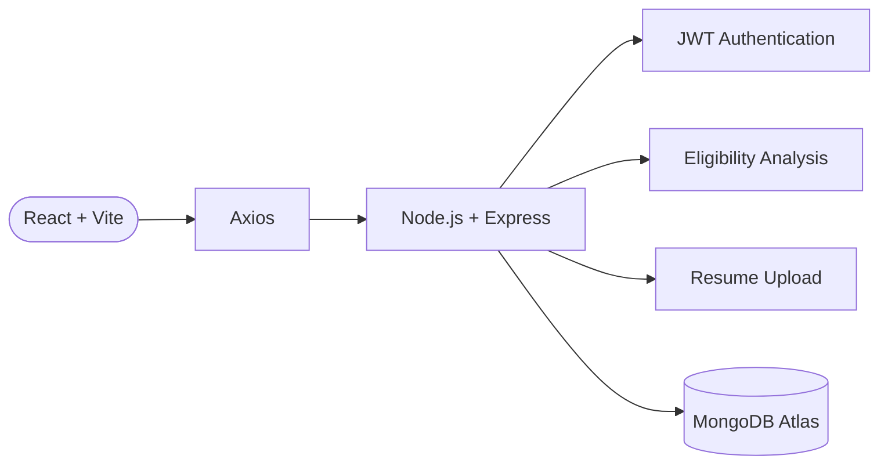
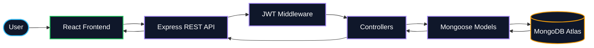

# 🎓 ELIGENTIA

### Smart Eligibility & Placement Intelligence Platform

> **Know Your Fit. Find Your Gaps. Build Your Future.**

ELIGENTIA is a MERN-stack web application designed to help students understand how well their profile matches a job opportunity.

Users can provide their academic and technical profile along with job requirements, and ELIGENTIA analyzes the information to provide an eligibility/match assessment, identify skill gaps, and suggest areas for improvement.

---

## 🚀 Live Project

🌐 **Live Demo:**
https://eligentiaa24.vercel.app/

🔗 **Backend API:**
https://eligentia-api.onrender.com/

🔗 **GitHub Repository:**
https://github.com/Kshitij2420/eligentia

---

## 📌 Why ELIGENTIA?

Students often apply for jobs without clearly understanding:

* Whether they satisfy the eligibility criteria
* Which required skills they already possess
* Which skills are missing
* Where their profile needs improvement
* How closely their profile matches a particular opportunity

ELIGENTIA brings these factors together into one platform.

### Example

A company requires:

```text
Java
SQL
React
Node.js
MongoDB
Git
```

A student has:

```text
Java
SQL
React
Git
```

ELIGENTIA can identify:

```text
Match: 66%

Matched Skills:
✓ Java
✓ SQL
✓ React
✓ Git

Missing Skills:
✗ Node.js
✗ MongoDB
```

The student can then focus on the missing skills before applying.

---

# ✨ Key Features

### 👤 Student Profile

Create and manage a profile containing relevant academic and technical information.

### 📄 Resume & Profile Analysis

Provide profile/resume information for eligibility analysis.

### 🎯 Eligibility Matching

Compare student information against job requirements.

### 📊 Match Percentage

Get a clear indication of how closely the profile matches the selected opportunity.

### 🔍 Skill Gap Detection

Identify skills required by a job but missing from the student's profile.

### 💡 Improvement Suggestions

Receive suggestions about areas that can be improved before applying.

### 🔐 Authentication

Secure user registration and login using:

* JWT authentication
* Password protection
* Protected API routes

### 📁 Resume Upload

The backend supports resume upload and processing workflows.

### 📈 Dashboard

A centralized dashboard allows users to view their profile and analysis information.

### 🐳 Docker Support

The complete application can be executed using Docker Compose.

---

# 🛠️ Tech Stack

## Frontend

* React.js
* Vite
* JavaScript
* HTML5
* CSS
* Tailwind CSS
* React Router
* Axios
* Recharts
* Lucide React

## Backend

* Node.js
* Express.js
* JavaScript
* REST API
* JWT
* Multer / file upload handling

## Database

* MongoDB
* MongoDB Atlas

## DevOps / Deployment

* Docker
* Docker Compose
* Nginx
* Docker Desktop
* WSL 2
* Git
* GitHub

## Deployment

* Frontend → Vercel
* Backend → Render
* Database → MongoDB Atlas

---

# 🏗️ Project Architecture

```text
                         ┌──────────────────────┐
                         │       User           │
                         │      Browser         │
                         └──────────┬───────────┘
                                    │
                                    ▼
                         ┌──────────────────────┐
                         │   React Frontend     │
                         │      + Vite          │
                         └──────────┬───────────┘
                                    │
                              HTTP / REST API
                                    │
                                    ▼
                         ┌──────────────────────┐
                         │   Node.js + Express  │
                         │      Backend API     │
                         └──────────┬───────────┘
                                    │
                  ┌─────────────────┴─────────────────┐
                  │                                   │
                  ▼                                   ▼
        ┌───────────────────┐              ┌───────────────────┐
        │    JWT Auth       │              │   MongoDB Atlas   │
        │  Protected APIs   │              │     Database      │
        └───────────────────┘              └───────────────────┘
```

---

# 📂 Project Structure

```text
eligentia/
│
├── client/
│   ├── src/
│   ├── public/
│   ├── Dockerfile
│   ├── .dockerignore
│   ├── package.json
│   └── vite.config.js
│
├── server/
│   ├── config/
│   ├── controllers/
│   ├── middleware/
│   ├── models/
│   ├── routes/
│   ├── services/
│   ├── uploads/
│   ├── utils/
│   ├── Dockerfile
│   ├── .dockerignore
│   ├── package.json
│   └── server.js
│
├── docker-compose.yml
├── .gitignore
└── README.md
```

---

# 🔄 Application Flow

```text
User
 │
 ▼
Register / Login
 │
 ▼
JWT Authentication
 │
 ▼
Student Profile
 │
 ▼
Job Requirements
 │
 ▼
Eligibility Analysis
 │
 ├── Match Percentage
 │
 ├── Matched Skills
 │
 ├── Missing Skills
 │
 └── Improvement Suggestions
 │
 ▼
Dashboard / Results
```

---

# 🔐 Authentication Flow

ELIGENTIA uses JWT-based authentication.

```text
User
 │
 ▼
Login
 │
 ▼
Express Backend
 │
 ▼
Credentials Validation
 │
 ▼
JWT Token
 │
 ▼
Frontend
 │
 ▼
Protected API Requests
 │
 ▼
JWT Middleware
 │
 ▼
Authorized Resource
```

Protected backend routes verify the JWT before allowing access to authenticated resources.

---

# ⚙️ Environment Variables

## Backend

Create:

```text
server/.env
```

Example:

```env
PORT=5000
MONGO_URI=your_mongodb_connection_string
JWT_SECRET=your_jwt_secret
CLIENT_URL=http://localhost:5173
```

> Never commit `.env` files containing secrets to GitHub.

---

## Frontend

For local development:

```env
VITE_API_URL=http://localhost:5000/api
```

The project also provides:

```text
client/.env.example
```

as a reference for configuring the frontend.

---

# 🐳 Docker Architecture

ELIGENTIA uses a multi-container Docker architecture.

The frontend runs inside a Docker container with **React + Nginx**, while the backend runs inside a separate **Node.js + Express** container. MongoDB Atlas is used as the external cloud database.

### Docker Workflow



### Docker Request Flow

```text
Browser
   │
   ▼
React Frontend
   │
   ▼
Nginx Container
   │
   ▼
Node.js + Express Container
   │
   ▼
MongoDB Atlas
```

### Docker Services

| Service  | Technology     | Container Port | Local Port |
| -------- | -------------- | -------------: | ---------: |
| Client   | React + Nginx  |             80 |       5173 |
| Server   | Node + Express |           5000 |       5000 |
| Database | MongoDB Atlas  |          Cloud |      Cloud |

---

# 🗄️ Database Architecture

ELIGENTIA uses **MongoDB Atlas** as its persistent cloud database.

The React frontend does **not** connect directly to MongoDB. All database requests pass through the Node.js + Express backend.

### Database Workflow



### Database Request Flow

```text
User / Browser
      │
      ▼
┌───────────────────────┐
│   React Frontend      │
│   Vite + Axios        │
└───────────┬───────────┘
            │
            │ REST API
            ▼
┌───────────────────────┐
│   Node.js + Express   │
│      REST API         │
└───────┬───────┬───────┘
        │       │
        │       └── JWT Authentication
        │           Protected Routes
        │
        │ MongoDB Connection
        ▼
┌──────────────────────────┐
│      MongoDB Atlas        │
│                          │
│ User / Profile /         │
│ Application-related      │
│ Data                     │
└──────────────────────────┘
```

### Database Security Flow



---

# 📄 Docker Files

## `client/Dockerfile`

The frontend uses a **multi-stage Docker build**.

```text
Node.js
   │
   ▼
Install dependencies
   │
   ▼
Build React application
   │
   ▼
Generate /dist
   │
   ▼
Nginx Alpine
   │
   ▼
Serve production frontend
```

The final container uses Nginx instead of running the Vite development server.

---

## `server/Dockerfile`

The backend container:

1. Uses Node.js 20 Alpine
2. Creates `/app`
3. Installs dependencies
4. Copies backend source code
5. Exposes port `5000`
6. Starts the Express server

---

# 🐳 Docker Compose

The root file:

```text
docker-compose.yml
```

orchestrates both services.

```yaml
services:

  server:
    build:
      context: ./server
    container_name: eligentia-server
    env_file:
      - ./server/.env
    ports:
      - "5000:5000"
    restart: unless-stopped

  client:
    build:
      context: ./client
    container_name: eligentia-client
    ports:
      - "5173:80"
    depends_on:
      - server
    restart: unless-stopped
```

### Services

| Service  | Technology     | Container Port | Local Port |
| -------- | -------------- | -------------: | ---------: |
| Client   | React + Nginx  |             80 |       5173 |
| Server   | Node + Express |           5000 |       5000 |
| Database | MongoDB Atlas  |          Cloud |      Cloud |

---

# ▶️ Running ELIGENTIA with Docker

## Prerequisites

Install:

* Docker Desktop
* WSL 2
* Git

Verify Docker:

```powershell
docker --version
```

Verify Compose:

```powershell
docker compose version
```

---

## 1. Clone Repository

```powershell
git clone https://github.com/Kshitij2420/eligentia.git
```

Move into the project:

```powershell
cd eligentia
```

---

## 2. Configure Backend Environment

Create:

```text
server/.env
```

Add your MongoDB and JWT configuration:

```env
PORT=5000
MONGO_URI=your_mongodb_connection_string
JWT_SECRET=your_secret
CLIENT_URL=http://localhost:5173
```

---

## 3. Build and Start Containers

```powershell
docker compose up -d --build
```

This command:

* Builds the frontend image
* Builds the backend image
* Creates the Docker network
* Creates both containers
* Starts the application in background mode

---

## 4. Check Containers

```powershell
docker compose ps
```

Expected:

```text
NAME               STATUS
eligentia-client   Up
eligentia-server   Up
```

---

## 5. Open Application

Frontend:

```text
http://localhost:5173
```

Backend:

```text
http://localhost:5000
```

Health endpoint:

```text
http://localhost:5000/api/health
```

Expected response:

```json
{
  "success": true,
  "message": "ELIGENTIA API is running"
}
```

---

# 🧰 Useful Docker Commands

### Start application

```powershell
docker compose up -d
```

### Start and rebuild

```powershell
docker compose up -d --build
```

### Stop containers

```powershell
docker compose down
```

### View running containers

```powershell
docker compose ps
```

### View all logs

```powershell
docker compose logs
```

### Follow logs live

```powershell
docker compose logs -f
```

### View backend logs

```powershell
docker compose logs -f server
```

### View frontend logs

```powershell
docker compose logs -f client
```

### View last 30 backend log lines

```powershell
docker compose logs --tail=30 server
```

### Rebuild only

```powershell
docker compose build
```

### Restart containers

```powershell
docker compose restart
```

---

# 🧹 Docker Cleanup

Stop and remove containers and the Compose network:

```powershell
docker compose down
```

Remove containers, network, and images created by Compose:

```powershell
docker compose down --rmi local
```

> Do not use aggressive Docker cleanup commands unless you understand what they remove.

Your MongoDB Atlas database is separate from these containers, so removing the containers does **not** delete the Atlas database.

---

# 🔒 Docker Security

The following files should not contain secrets:

```text
Dockerfile
docker-compose.yml
README.md
```

Sensitive values should remain in:

```text
server/.env
```

The `.env` file should remain ignored by Git.

The project also uses:

```text
client/.dockerignore
server/.dockerignore
```

to prevent unnecessary files such as:

```text
node_modules
.env
.git
npm-debug.log
```

from being included in Docker build contexts.

---

# ☁️ Deployment Architecture

The project currently supports a cloud deployment architecture:

```text
                 Internet
                    │
                    ▼
          ┌───────────────────┐
          │      Vercel       │
          │ React Frontend    │
          └─────────┬─────────┘
                    │
                    ▼
          ┌───────────────────┐
          │      Render       │
          │ Node + Express    │
          └─────────┬─────────┘
                    │
                    ▼
          ┌───────────────────┐
          │   MongoDB Atlas   │
          └───────────────────┘
```

Docker provides a reproducible local/containerized environment for the same application.

---

# 🧪 Local Development Without Docker

### Frontend

```powershell
cd client
npm install
npm run dev
```

### Backend

```powershell
cd server
npm install
npm start
```

Docker is recommended when you want the frontend and backend environments to be isolated and reproducible.

---

# 🧠 What I Learned From This Project

Through ELIGENTIA, I worked with:

* MERN stack development
* React component architecture
* REST API development
* JWT authentication
* MongoDB Atlas
* API integration using Axios
* File upload handling
* Environment variables
* Docker images
* Docker containers
* Docker Compose
* Multi-stage Docker builds
* Nginx
* WSL 2
* Git & GitHub
* Vercel deployment
* Render deployment

---

# 🚧 Future Improvements

Potential future enhancements include:

* AI-powered resume parsing
* More advanced job-description analysis
* Automated skill extraction
* Personalized learning roadmap
* Job recommendation system
* Resume scoring
* More detailed analytics
* Cloud-based resume storage
* Role-based dashboards
* Automated job matching

---

# 👨‍💻 Developer

### Kshitij Rastogi

**MCA Student | Software Developer**

Interested in:

```text
Java
DSA
MERN Stack
Web Development
AI/ML
Cloud & Docker
```

GitHub:

https://github.com/Kshitij2420

---

# ⭐ Project

If you find ELIGENTIA useful or interesting, consider giving the repository a ⭐ on GitHub.

> **ELIGENTIA — Know Your Fit. Find Your Gaps. Build Your Future.**

---

# 💼 Recruiter-Focused Project Summary

**ELIGENTIA** is a full-stack **MERN-based Smart Eligibility & Placement Intelligence Platform** that helps students evaluate their profile against job requirements, identify skill gaps, and understand areas for improvement.

### Engineering Highlights

* **Full-stack MERN architecture** with a React + Vite frontend and Node.js + Express REST API backend.
* Implemented **JWT-based authentication** with protected backend routes for secure user access.
* Integrated **MongoDB Atlas** for persistent user, profile, and application-related data.
* Built RESTful API communication between frontend and backend using **Axios**.
* Implemented **resume/file upload workflows** on the backend.
* Developed eligibility analysis functionality to identify **matched skills, missing skills, and profile gaps** against job requirements.
* Used **Recharts** to present profile and analysis information through visual dashboards.
* Containerized the frontend and backend using **Docker** and created a multi-container development environment with **Docker Compose**.
* Used a **multi-stage Docker build** for the React frontend, with Nginx serving the optimized production build.
* Configured separate frontend and backend environments using **environment variables**, keeping sensitive configuration outside source control.
* Deployed the application using **Vercel, Render, and MongoDB Atlas**.

### Architecture



### Docker Architecture


### Database Architecture



### Project Value

The project demonstrates practical experience across the **frontend, backend, database, authentication, API integration, deployment, and containerization layers** of a modern web application.

It also demonstrates the ability to take a project from development through **Git/GitHub version control, Docker-based local deployment, and cloud deployment**.
